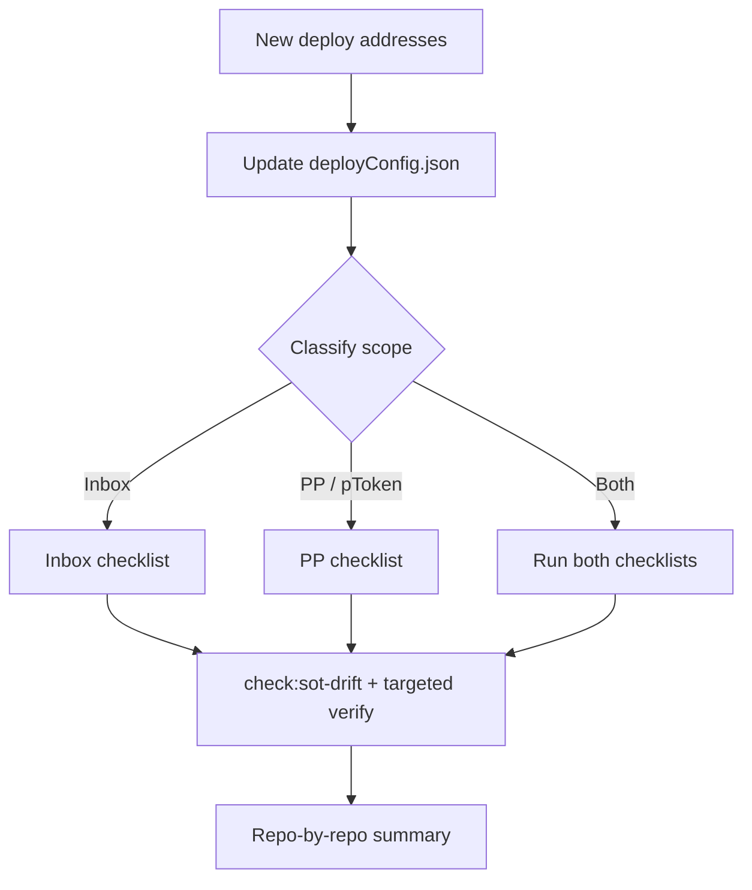

# PoD Deployment Update (Inbox vs Privacy Portal)

## When To Use

Use this skill after a **testnet/mainnet deploy** when addresses or salts in
`deployConfig.json` changed and consumers must be brought in sync.

**Do not** use this for UI fee/oracle migration (`pod-pp-fee-oracle-upgrade`) or
building deposit/withdraw UI (`pod-privacy-portal`). Those are product skills;
this is an **ops / consistency rollout** skill.

## Source Of Truth

1. Read [`deployConfig.json`](../../../deployConfig.json) first.
2. Classify the change **before editing anything**:
   - **Inbox-only** — `inboxSalt.*`, `chains.*.inbox`, shared mother/executor
     wiring, inbox fee/oracle runbook.
   - **Privacy Portal / pToken-only** — `portalImplementation`,
     `podTokenImplementation`, `privacyPortalFactory`,
     `privacyPortalTokens.*`, `portalFee`, PP factory constructor / oracle
     consumers.
   - **Combined** — run **both** checklists; do not skip the scope split.
3. Prefer writing new addresses into `deployConfig.json`, then fan out. Do not
   hand-copy addresses into sibling repos first.

For the full file inventory, read [reference.md](reference.md).

## Scope Split (critical)

| Scope | Touches | Does **not** imply |
|-------|---------|-------------------|
| **Inbox** | Shared CREATE3 inbox address / salt, SDK defaults, `PodNetworkConstants`, explorer shared inbox, docs Inbox tables, payroll inbox fields, CreateX salt label, verify scripts that hardcode inbox | New portal/pToken instances |
| **Privacy Portal** | Per-chain factory, implementations, each `privacyPortalTokens.<symbol>.{portal,pToken,underlying,…}`, portal fees, PP deploy/remount scripts & tests, admin PP docs | Global inbox consumer updates |

A PP remount / new pToken set on Fuji or Sepolia **does not** require updating
SDK `DEFAULT_INBOX_ADDRESS` or Solidity `INBOX` unless the inbox address also
changed.

An inbox salt bump **does** require updating every shared inbox consumer even if
portals were left alone.



## Inbox Update Checklist

Copy and track:

```
Inbox rollout:
- [ ] 1. SoT: inboxSalt.label / salt / address; chains.*.inbox (11155111, 43113, 7082400)
- [ ] 2. SoT: related shared infra if redeployed (cotiExecutor, cotiMother, priceOracle, feeConfig, gasPriceBounds)
- [ ] 3. PEI: scripts/createx.ts INBOX_SALT_LABEL matches inboxSalt.label
- [ ] 4. PEI: verify / deploy scripts — no legacy inbox hardcodes; read from deployConfig
- [ ] 5. coti-sdk-pod: src/consts.ts DEFAULT_INBOX_ADDRESS (and any chain maps)
- [ ] 6. coti-contracts + coti-pod-inbox-contracts: PodNetworkConstants.sol (EIP-55 checksum!)
- [ ] 7. pod-explorer: SHARED_INBOX_ADDRESS / network inbox config
- [ ] 8. pod-dapp-ports: Fuji payroll manifest inboxSource / inboxCoti / mpcExecutor
- [ ] 9. documentation: privacy-on-demand/networks/{sepolia,fuji,coti-testnet}.md Inbox rows
- [ ] 10. Validate: npm run check:sot-drift (and per-repo wrappers)
```

Notes:

- Bump `inboxSalt.label` (and clear salt/address) whenever Inbox **bytecode**
  changes before redeploy — see `inboxSalt.bytecodeNote` / `runbook`.
- Solidity address literals must be **EIP-55 checksummed** (solc rejects
  lowercase).
- After SoT + consumers: run deploy-cli inbox post-steps only if this was a
  live redeploy (`priceOracle` → `feeConfig` → `wireInboxOracle` per README).

## Privacy Portal / pToken Update Checklist

Copy and track (per target chain, usually `11155111` and/or `43113`):

```
PP / pToken rollout:
- [ ] 1. SoT: portalImplementation, podTokenImplementation, privacyPortalFactory
- [ ] 2. SoT: privacyPortalTokens.<symbol>.{underlying, portal, pToken, motherRegistrationRequestId}
- [ ] 3. SoT: portalFee + privacyPortalFactoryConstructor + oracle.consumers.privacyPortalFactory
- [ ] 4. PEI: scripts/privacyPortal/* and any remount helpers/tests that snapshot addresses
- [ ] 5. PEI: sync-token-list / canonical-collateral if underlyings or symbols changed
- [ ] 6. Ports / dapps: payroll or app manifests that pin privacyPortal / pToken
- [ ] 7. Docs / skills: network pages, admin runbooks, UI skills with hardcoded PP snapshots
- [ ] 8. Validate: verify:deployments:config and PP-focused tests; sot-drift ports scope if payroll changed
```

Notes:

- Soft remount (`createPortalWithExistingPToken`) keeps the **same pToken** and
  requires old portal paused — do not flip wrap mode. Update SoT portal address;
  pToken may be unchanged.
- PP-only rollout: **skip** SDK / `PodNetworkConstants` / explorer shared inbox
  unless inbox also moved.
- Prefer loading addresses from `deployConfig.json` over stale
  `PrivacyPortalConfig.json` snapshots in skills/docs.

## Validation

From `pod-ecosystem-integration` (sibling clones under `../`):

```bash
npm run check:sot-drift
# or scoped:
npm run check:sot-drift -- --scope=pei
npm run check:sot-drift -- --scope=sdk   # inbox scope
npm run check:sot-drift -- --scope=ports # PP payroll / portal pins
npm run verify:deployments:config       # SoT vs expected wiring
```

Run only tests that match the changed surface (inbox gas/events, PP remount,
PP system tests). Do not treat full-suite green as required for a docs-only
address fan-out.

## Output Format

End every rollout with:

```markdown
## Deployment update summary

**Scope:** inbox | privacy-portal | combined
**Chains:** …

### SoT fields changed
- …

### Repos / docs updated
| Repo | Files | Why |
|------|-------|-----|

### Validations
- check:sot-drift: …
- other: …

### Intentionally unchanged (out of scope)
- …
```

## Related

- Deploy / verify runbook: [`scripts/privacyPortal/README.md`](../../../scripts/privacyPortal/README.md)
- Drift guard: [`scripts/sot-drift/README.md`](../../../scripts/sot-drift/README.md)
- Repo file map: [reference.md](reference.md)
- UI skills (not this workflow): `pod-privacy-portal`, `pod-pp-fee-oracle-upgrade`
