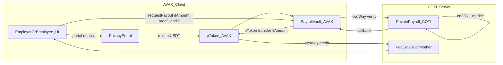

# Sablier → Private Payroll Conversion

## When To Use

Use this skill when asked to **analyze, convert, or build** a public EVM distribution app — especially [Sablier airdrops](https://github.com/sablier-labs/evm-monorepo/tree/main/airdrops/src) — into **async private payroll** split across:

- **AVAX (Fuji / source chain):** request submission, public run metadata, end-user-encrypted inputs (`itUint*`) readable only by the UI
- **COTI (PoD compute chain):** MPC processing on `gtUint*` / ciphertext; eligibility verify; pToken balance credit

**Default product model:** employer funds **p.USDT** via `PrivacyPortal.deposit`; employees receive **encrypted pToken credit**; optional partial withdraw to public chain.

Reference implementation: `/tmp/pod-payroll-eval/` (temp build validated by E2E test).

## Core Model

Converting a public app to private is **not** a direct port. Every piece of logic must be rethought as a **client-server model**:

1. **AVAX is the client.** Submits inbox requests, holds pToken payroll pool, forwards encrypted UI inputs. AVAX contracts must **never** decrypt or branch on plaintext salary amounts.
2. **COTI is the server.** Merkle path verify on `leafHash`, private `eq256` amount match, spent flags.
3. **The UI is the encryption boundary.** `itUint*` blobs on AVAX are end-user-encrypted inputs the UI creates and later decrypts.
4. **Actions are async.** Mined AVAX tx = request submitted. Payout complete only after pToken transfer callback. May require **two async hops** (verify + transfer).

## Read First

Read these files in this skill folder **in order**:

| File | Contents |
|------|----------|
| `conversion-to-pod.md` | **Start here** — what PoD conversion means, business logic changes, what was built |
| `fork-decisions.md` | **Required early gate** — pToken default, encrypted-leaf merkle, no AVAX index |
| `reference.md` | Sablier anatomy, PoD primitives, encrypted-merkle spec |
| `visibility-matrix.md` | Role-based visibility template — blocking gate |
| `messaging-decisions.md` | One-way vs two-way; nested async (verify + transfer) |
| `sablier-instant-mapping.md` | Per-function mapping with pToken payout |
| `implementation-patterns.md` | Copy-paste contract patterns from temp build |
| `test-harness.md` | E2E test steps and build gate |
| `conversion-checklist.md` | Audit worksheet + build gates |
| `examples.md` | p.USDT payroll walkthrough |
| `extensions.md` | LL/LT/VCA vesting notes |

## Mandatory Workflow

Execute these phases **in order**.

### Phase 1 — Inventory (read-only)

Catalog Sablier Instant: factory, `SablierMerkleBase`, claim paths, events, leaks.

### Phase 2 — Fork decisions (blocking gate)

Fill `fork-decisions.md` — pToken payout, encrypted-leaf merkle, no AVAX index, async shape.

### Phase 3 — Visibility design

Fill `visibility-matrix.md` for all roles.

### Phase 4 — Client-server split

- **AVAX `PayrollVault`:** `requestPayout(runId, itAmount, proofHandle)`; pToken pool; callbacks
- **COTI `PrivatePayroll`:** `registerLeaf`, `verifyAndCredit`; merkle on `leafHash` + `eq256`

### Phase 5 — Messaging decisions

Document: one-way employer `registerLeaf`; two-way verify; two-way pToken transfer (v1 nested).

### Phase 6 — Sablier mapping

Apply `sablier-instant-mapping.md`.

### Phase 7 — UI rules

Mirror `pod-privacy-portal`: async state, dual request IDs, separate fee quotes.

### Phase 8 — Build validation

- Contracts compile
- `payroll-e2e.test.ts` passes (see `test-harness.md`)
- `conversion-checklist.md` build gates checked

## Deliverable

1. Filled visibility matrix
2. Fork decision log
3. Per-function AVAX vs COTI split
4. Messaging plan with nested async noted
5. Sequence diagram
6. UI state machine (verify + transfer legs)
7. Build status: E2E pass or documented blockers

## Related Skills

- **`pod-privacy-portal`** — portal deposit, pToken lifecycle, async UX
- **`pod-pp-fee-oracle-upgrade`** — dual fee quoting
- **`gt-type-upgrade`** — gt/it/ct type rules

## Do Not Assume

- Do not use public `safeTransfer` for private salary payout — use **pToken `transfer(itUint256)`**
- Do not put `index` or plaintext `amount` in AVAX claim calldata
- Do not `MerkleProof.verify` on AVAX with private amounts
- Do not `MpcCore.decrypt` in AVAX callback
- Do not treat mined tx as paid — wait for pToken transfer callback
- Do not assume one fee estimate covers portal + PoD inbox legs

## Out of Scope

- Fuji/mainnet deployment scripts
- Full Sablier LL/LT/VCA (see `extensions.md`)
- Clawback in v1 temp impl
