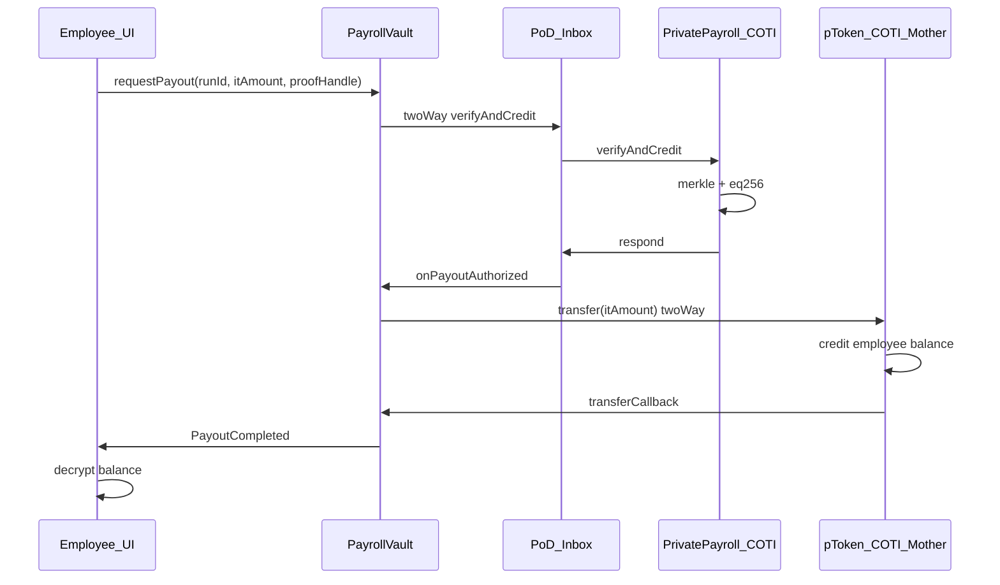

# Example: p.USDT Instant Payroll Claim

End-to-end walkthrough for the **default product model**: encrypted-leaf merkle, pToken payout, no AVAX index.

Reference impl: `/tmp/pod-payroll-eval/`

---

## Assumptions

- Network: AVAX Fuji (client) + COTI (server) — Hardhat dual-chain for tests
- Payout: p.USDT via `PrivacyPortal` + `PodErc20Mintable`
- Merkle: encrypted-leaf commitments (`leafHash`)
- Async: v1 nested (verify two-way + transfer two-way)
- Employee uses COTI SDK encryption key in browser UI

---

## Actors and contracts

| Actor / Contract | Role |
|------------------|------|
| Employer | Creates run, funds vault via portal, registers leaves on COTI |
| Employee | Claims payout with encrypted amount + proofHandle |
| `PrivacyPortal` | Locks USDT, mints p.USDT to vault |
| `PayrollVault` (AVAX) | Submits verify request; triggers pToken transfer on callback |
| `PrivatePayrollCoti` (COTI) | Merkle verify + eq256 + spent flag |
| `PodErc20Mintable` | Private transfer on second async hop |
| Employee UI | Encrypt, submit, poll, decrypt balance |

---

## Setup phase (employer)

### 1. Build encrypted merkle off-chain

For each employee:

```
salary = 1000 USDT (example)
itAmount = SDK.encrypt(salary, employeeKey)
ctCommitment = hash(itAmount.ciphertext)
leafHash = keccak256(abi.encode(employeeAddress, ctCommitment))
```

Build merkle tree from all `leafHash` values → `eligibilityRoot`.

Distribute to each employee (secure channel): `{ leafHash, merkleProof, itAmount }`.

### 2. Create payroll run on AVAX

```
PayrollVault.createRun(
  eligibilityRoot: 0xabc...,
  pToken: pUSDT_address,
  startTime, expiration
)
→ RunCreated(runId=1, eligibilityRoot, pToken)
```

### 3. Register on COTI

```
PrivatePayroll.registerRun(runId=1, eligibilityRoot=0xabc...)

For each employee:
  PrivatePayroll.registerLeaf(runId=1, leafHash, employeeAddress, itAmount)
```

Messaging: direct COTI txs in demo; production may use one-way from AVAX.

### 4. Fund vault with p.USDT

Employer approves USDT and deposits via portal:

```
PrivacyPortal.deposit(
  recipient: PayrollVault,
  amount: totalPayrollBudget,
  portalFee, mintCallbackFee
) payable
→ wait for mint callback → vault holds p.USDT garbled balance
```

No plaintext salary on-chain. Only aggregate USDT deposit visible.

---

## Claim phase (employee)

### 5. UI prepares claim

```
proofHandle = abi.encode(merkleProof, leafHash)
itAmount = from employer package (or re-encrypt same salary)
Quote: portalFee (if any) + podInboxFee × 2 (verify + transfer legs)
```

UI state: **Ready**

### 6. Submit requestPayout (verify leg)

```
PayrollVault.requestPayout{value: verifyFee}(
  runId: 1,
  itAmount: <encrypted>,
  proofHandle: <opaque>,
  callbackFeeLocalWei
)
→ PayoutRequested(requestId=0xdef..., runId=1)
```

**No index. No plaintext amount. No recipient in calldata** — claimant is `msg.sender`.

UI state: **VerifySubmitted**

### 7. COTI verification

Inbox delivers to `PrivatePayrollCoti.verifyAndCredit`:

1. Decode `(proof, leafHash)` from proofHandle
2. `MerkleProof.verify(proof, root, leafHash)`
3. `eq256(registered[leafHash], itAmount)`
4. `claimant == registeredEmployee[leafHash]`
5. `spent[leafHash] = true`
6. `inbox.respond(abi.encode(runId, leafHash, claimant, itAmount))`

### 8. AVAX callback — start transfer leg

```
PayrollVault.onPayoutAuthorized(data)
→ pToken.transfer{value: transferFee}(claimant, itAmount, transferCallbackFee)
→ PayoutTransferRequested(requestId, transferId, runId)
```

UI state: **TransferSubmitted**

### 9. COTI pToken credit

Second two-way: `PodErc20CotiMother` credits employee garbled balance from vault pool.

### 10. UI confirmation

```
Poll pToken.balanceOfWithStatus(employee)
Decrypt with SDK → salary amount
```

UI state: **Paid**

Employee may later `requestWithdrawWithPermit` for partial USDT — remainder stays private on COTI.

---

## Failure branch

COTI rejects (bad proof, wrong amount, already spent):

1. `inbox.raise(...)` → AVAX `onPayoutRejected`
2. `payoutRequestStatus[requestId] = Failed`
3. No pToken transfer initiated
4. UI: retry allowed

```
Ready → VerifySubmitted → VerifyPending → TransferSubmitted → Paid
                          └→ Failed
```

---

## Sequence diagram



---

## What Sablier did vs private payroll

| Sablier (1 tx) | Private payroll (2+ async hops) |
|----------------|--------------------------------|
| Public index, amount, recipient in calldata | runId + itAmount + opaque proofHandle only |
| Merkle verify on AVAX | Merkle verify on COTI against leafHash |
| Sync ERC20 transfer | Async pToken transfer with encrypted amount |
| `ClaimInstant` leaks all fields | Minimal events |

---

## Optional partial withdraw

Employee keeps most salary private:

```
requestWithdrawWithPermit(amount: partialAmount, ...)
→ async portal release of partial USDT
→ remaining p.USDT balance stays encrypted on COTI
```

See `pod-privacy-portal` for withdraw UX rules.
