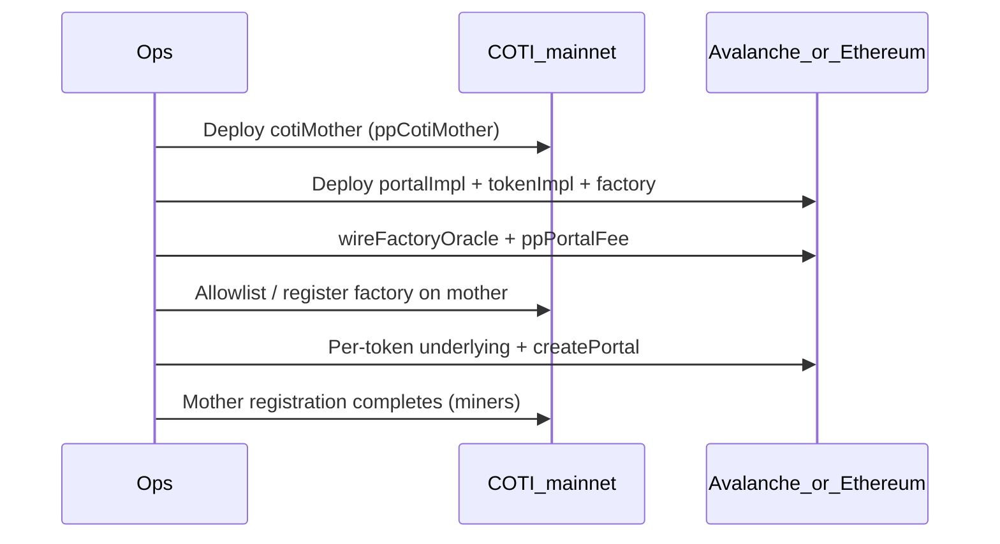

# Privacy Portal mainnet launch

Deploy Privacy Portal after the PoD Inbox + oracle stack is live on **source** (Avalanche and/or Ethereum) and **COTI mainnet**.

Config: `DEPLOY_CONFIG=deployConfig.mainnet.yaml`  
Tokens: any list under `chains.<sourceId>.privacyPortalTokens` (no hardcoded CLI token set).

## Sequence



### 1. COTI mother

```bash
export DEPLOY_CONFIG=deployConfig.mainnet.yaml
DEPLOY_CLI_NETWORK=cotiMainnet DEPLOY_CLI_TARGETS=ppCotiMother,ppCotiMotherAllowlist \
  npm run deploy:cli
```

Requires COTI `inbox` already deployed and wired.

### 2. Source implementations + factory

On Avalanche (`43114`) and/or Ethereum (`1`):

```bash
DEPLOY_CLI_NETWORK=avalanche \
DEPLOY_CLI_TARGETS=ppPortalImpl,ppTokenImpl,ppPortalFactory,wireFactoryOracle,ppPortalFee \
  npm run deploy:cli
```

Factory constructor snapshot (fee recipient, portal fees) is recorded under `privacyPortalFactoryConstructor`.

### 3. Register factory on COTI mother

CLI target `ppCotiMotherAllowlist` (COTI) and/or factory-side registration helpers ensure the source factory is authorized to request mother registrations.

### 4. Tokens from YAML

Example Avalanche entry:

```yaml
chains:
  "43114":
    privacyPortalTokens:
      p.USDC:
        underlying: "0xB97EF9Ef8734C71904D8002F8b6Bc66Dd9fcd248"
        pName: "Private USDC"
        pSymbol: "pUSDC"
        decimals: 6
        underlyingKind: canonical
        canonicalKey: USDC
        portal: ""
        pToken: ""
      p.WAVAX:
        underlying: "0xB31f66AA3C1e785363F0875A1B74E27b85FD66c7"
        pName: "Private WAVAX"
        pSymbol: "pWAVAX"
        decimals: 18
        underlyingKind: canonical
        canonicalKey: WAVAX
```

Then:

```bash
DEPLOY_CLI_NETWORK=avalanche \
DEPLOY_CLI_TARGETS=ppUnderlying:p.USDC,ppPortal:p.USDC,ppUnderlying:p.WAVAX,ppPortal:p.WAVAX \
  npm run deploy:cli
```

Or pick targets interactively — the menu is built from whatever keys exist for the connected chain.

`ppRetryMotherReg` retries mother registration if miners were delayed.

### 5. Portal fees

`chains.<id>.portalFee.deposit` / `.withdraw` (fixed + bps + max). Applied via `ppPortalFee`.

## Pairing

| Source chain | COTI pair |
|--------------|-----------|
| Ethereum `1` | COTI mainnet `2632500` |
| Avalanche `43114` | COTI mainnet `2632500` |
| Sepolia / Fuji | COTI testnet `7082400` |

## Fork dry-run

```bash
# Anvil source + sim-coti Hardhat-fork of COTI tip (Anvil COTI fork is not supported)
npm run fork:cli -- setup --source avalanche --coti mainnet
# forks.enabled: true; cotiRpc → sim-coti :8546 (forked tip + MPC inject)

export DEPLOY_CONFIG=deployConfig.mainnet.yaml
export AVALANCHE_RPC_URL=http://127.0.0.1:8545
export SIM_COTI_RPC_URL=http://127.0.0.1:8546
export COTI_FORK_NETWORK=localSimCoti

# Source: DEPLOY_CLI_NETWORK=avalanche|ethereum
# COTI:   DEPLOY_CLI_NETWORK=localSimCoti
```

Mother registration waits for off-chain miners. For dry-run, bring up the
relayer stack from `pod-integration-tests` (`deployment-runner.sh … up`) **before**
`ppPortal` / mother-reg steps, then use `ppRetryMotherReg` if needed.

See `pod-integration-tests/deployments/builder/MAINNET.md` for the full dry-run order.

## Smoke test (read-only)

```bash
DEPLOY_CONFIG=deployConfig.mainnet.yaml PP_MAINNET_SMOKE=1 npm run test:pp-mainnet-smoke
```
