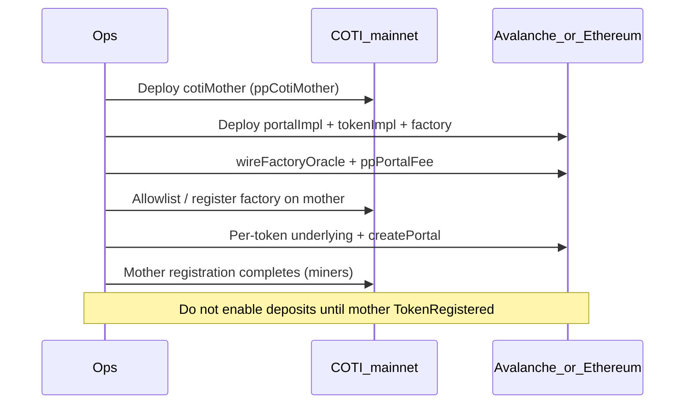

# Privacy Portal mainnet launch

Deploy Privacy Portal after the PoD Inbox + oracle stack is live on **source** (Avalanche and/or Ethereum) and **COTI mainnet**.

Config: `DEPLOY_CONFIG=deployConfig.mainnet.yaml`  
Tokens: any list under `chains.<sourceId>.privacyPortalTokens` (no hardcoded CLI token set).

## Sequence



**Registration footgun:** `createPortal` returns as soon as the one-way mother registration message is *submitted*, not when the mother has registered the pToken. Deposits before `TokenRegistered` can leave mint requests stuck Pending (`TokenNotRegistered` on COTI). Leave `isDepositEnabled=false` until registration is confirmed; use admin refund for any stuck Pending escrows.

### 1. COTI mother

```bash
export DEPLOY_CONFIG=deployConfig.mainnet.yaml
DEPLOY_CLI_NETWORK=cotiMainnet DEPLOY_CLI_TARGETS=ppCotiMother,ppCotiMotherAllowlist \
  npm run deploy:cli
```

Requires COTI `inbox` already deployed and wired.

### 2. Source implementations + factory

On Avalanche (`43114`) and/or Ethereum (`1`):

```bash
DEPLOY_CLI_NETWORK=avalanche \
DEPLOY_CLI_TARGETS=ppPortalImpl,ppTokenImpl,ppPortalFactory,wireFactoryOracle,ppPortalFee \
  npm run deploy:cli
```

Factory constructor snapshot (fee recipient, portal fees) is recorded under `privacyPortalFactoryConstructor`.

### 3. Register factory on COTI mother

CLI target `ppCotiMotherAllowlist` (COTI) and/or factory-side registration helpers ensure the source factory is authorized to request mother registrations.

### 4. Tokens from YAML

Example Avalanche entry:

```yaml
chains:
  "43114":
    privacyPortalTokens:
      p.USDC:
        underlying: "0xB97EF9Ef8734C71904D8002F8b6Bc66Dd9fcd248"
        pName: "Private USDC"
        pSymbol: "pUSDC"
        decimals: 6
        underlyingKind: canonical
        canonicalKey: USDC
        portal: ""
        pToken: ""
      p.WAVAX:
        underlying: "0xB31f66AA3C1e785363F0875A1B74E27b85FD66c7"
        pName: "Private WAVAX"
        pSymbol: "pWAVAX"
        decimals: 18
        underlyingKind: canonical
        canonicalKey: WAVAX
```

Then:

```bash
DEPLOY_CLI_NETWORK=avalanche \
DEPLOY_CLI_TARGETS=ppUnderlying:p.USDC,ppPortal:p.USDC,ppUnderlying:p.WAVAX,ppPortal:p.WAVAX \
  npm run deploy:cli
```

Or pick targets interactively — the menu is built from whatever keys exist for the connected chain.

`ppRetryMotherReg` retries mother registration if miners were delayed.

### 5. Portal fees

`chains.<id>.portalFee.deposit` / `.withdraw` (fixed + bps + max). Applied via `ppPortalFee`.

## Pairing

| Source chain | COTI pair |
|--------------|-----------|
| Ethereum `1` | COTI mainnet `2632500` |
| Avalanche `43114` | COTI mainnet `2632500` |
| Sepolia / Fuji | COTI testnet `7082400` |

## Fork dry-run

```bash
npm run fork:cli -- setup --source avalanche --coti mainnet
# enable forks in YAML, then deploy against forkSource / forkCoti
```

## Smoke test (read-only)

```bash
DEPLOY_CONFIG=deployConfig.mainnet.yaml PP_MAINNET_SMOKE=1 npm run test:pp-mainnet-smoke
```

## Portal remount / upgrade (ops)

If you must replace a portal clone while keeping the same pToken, follow **[docs/admin/PORTAL_UPGRADE_CHECKLIST.md](../admin/PORTAL_UPGRADE_CHECKLIST.md)** (M-31):

1. Pause deposits.
2. Finalize or kill **all** pending withdrawals / in-flight burns (and never remount mid-rescue).
3. `retireDepositsForUpgrade` / remount via `createPortalWithExistingPToken`.
4. Migrate collateral, then open the new portal.

Do **not** remount with in-flight withdraw or rescue mid-flight — withdraw callbacks still target the old portal address.
