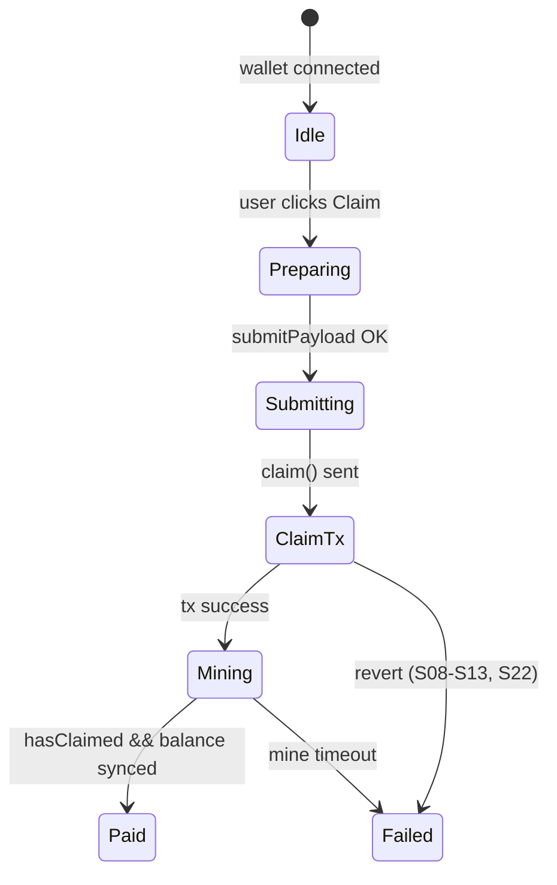

# Airdrop campaign UI — screen-by-screen build checklist

Reference UI: [Sablier Airdrops campaign page](https://app.sablier.com/airdrops/campaign/0x3b0b354f7f61511cfab09f9582ed527ea669f80b-1) (Merkle **Instant**).

Our backends:

| Stack | Campaign contract | Token |
|-------|-------------------|-------|
| **Native (Phase 1)** | `SablierMerkleInstantHarness` | Public ERC20 (`PUSD`) |
| **PoD (Phase 2)** | `PayrollCampaignFacade` | Encrypted pToken (`pPUSD`) |

Sablier docs: [Airdrops features](https://docs.sablier.com/apps/features/airdrops), [Merkle API](https://docs.sablier.com/api/airdrops/merkle-api/overview), [`SablierMerkleInstant`](https://docs.sablier.com/reference/airdrops/contracts/contract.SablierMerkleInstant).

**Legend:** ✅ ready · ⚠️ partial · ❌ gap · 🔒 PoD-only extra

---

## Page map

```
┌─────────────────────────────────────────────────────────────┐
│  HEADER — name, token, chain, type badge                    │
├─────────────────────────────────────────────────────────────┤
│  STATS ROW — funded, claimed %, recipients, time window     │
├──────────────────────┬──────────────────────────────────────┤
│  ELIGIBILITY CARD    │  ADMIN PANEL (admin wallet only)     │
│  (connected wallet)  │  fund · clawback · settings          │
├──────────────────────┴──────────────────────────────────────┤
│  CLAIM CTA — amount, fee, claim / claimTo                   │
├─────────────────────────────────────────────────────────────┤
│  ACTIVITY — ClaimInstant / Clawback timeline                  │
└─────────────────────────────────────────────────────────────┘
```

Separate flow (not on campaign page): **Create wizard** (configure → CSV → deploy).

---

## 1. Header

| Widget | Sablier shows | Native API | PoD API | Stories | Status |
|--------|---------------|------------|---------|---------|--------|
| Campaign name | Title | `campaignName()` | `campaignName()` | S01 | ✅ |
| Campaign address | `0x…-chainId` in URL | deploy address | facade address | S01 | ✅ |
| Token symbol / logo | ERC-20 + icon | `TOKEN()` → `symbol()` | `TOKEN()` → pToken metadata | S01 | ⚠️ no token list |
| Chain badge | e.g. Arbitrum | `chainId` from wallet | AVAX surrogate / prod chain | — | ⚠️ app config |
| Type badge | “Instant” vs vested | fixed Instant | fixed Instant | — | ✅ |
| IPFS / criteria link | Optional link | `ipfsCID()` | — | — | ❌ |
| Share button | Copy campaign URL | `window.location` | same | — | ✅ (no indexer) |

**Gap:** `ipfsCID`, token list logos, Sablier subgraph campaign metadata.

---

## 2. Stats row

| Widget | Sablier shows | Native API | PoD API | Stories | Status |
|--------|---------------|------------|---------|---------|--------|
| Total allocation | Sum of CSV amounts | off-chain roster | off-chain roster | S02, S17 | ⚠️ off-chain only |
| Recipient count | From deploy event | off-chain | off-chain | S02 | ⚠️ off-chain only |
| Funded balance | ERC-20 on campaign | `token.balanceOf(campaign)` | decrypt `balanceOf(facade)` after sync | S03, S17 | ✅ / ⚠️ PoD async sync |
| Claimed count / % | Subgraph | scan `ClaimInstant` + `hasClaimed` | same + poll payout | S16, S17 | ⚠️ no subgraph |
| Remaining budget | funded − paid | `balanceOf` | decrypted balance | S17 | ✅ |
| Start time | `CAMPAIGN_START_TIME` | `CAMPAIGN_START_TIME()` | same | S12, S27b | ✅ |
| Expiration | `EXPIRATION` (0 = none) | `EXPIRATION()`, `hasExpired()` | same | S13, S27c | ✅ |
| First claim time | Shown after first claim | `firstClaimTime()` | same (set on callback) | S15 | ⚠️ PoD: after mine |
| Grace window | 7 days after first claim | derived from `firstClaimTime` | same | S15 | ✅ |

**Gap:** Sablier [Merkle subgraph](https://docs.sablier.com/api/airdrops/merkle-api/overview) for aggregate stats; build indexer or compute client-side from events.

---

## 3. Eligibility card (connected wallet)

| Widget | Sablier shows | Native API | PoD API | Stories | Status |
|--------|---------------|------------|---------|---------|--------|
| “Check eligibility” | Merkle API lookup | `buildSablierTree` + match `recipient` | same + `amountCommitment` leaf | S02, S04 | ⚠️ self-host merkle JSON |
| Allocation amount | Plaintext from tree | `package.amount` | `package.amount` (UI); on-chain commitment only | S04 | ✅ UI / 🔒 chain |
| Merkle index | Hidden or shown | `package.index` | same | S04 | ✅ |
| Proof | From Merkle API | `package.proof` | same | S08 | ⚠️ client-held |
| Registered recipient check | Implicit in proof | merkle leaf | `registeredRecipient(index)` | S11, S25 | ✅ PoD extra |
| Not eligible state | Empty card | no package for address | same | — | ✅ |
| Multiple slots same wallet | Second line | `packageAt(i)` | same | S27 | ✅ |
| Geo restriction banner | App-only block | — | — | — | ❌ |

**Native read calls when wallet connects:**

```ts
// 1. Off-chain (replace with Merkle API in production)
const pkg = tree.packageFor(connectedAddress);
if (!pkg) → "Not eligible"

// 2. On-chain
await campaign.read.hasClaimed([BigInt(pkg.index)]);
await campaign.read.hasExpired();
const start = await campaign.read.CAMPAIGN_START_TIME();
```

**PoD adds:**

```ts
await facade.read.registeredRecipient([BigInt(pkg.index)]);
await facade.read.amountCommitment([BigInt(pkg.index)]);
// pkg.amount still from off-chain roster for IT build
```

**Gap:** Sablier Merkle API + IPFS hosting; geo restrictions (interface-only on Sablier).

---

## 4. Claim CTA

| Widget | Sablier shows | Native API | PoD API | Stories | Status |
|--------|---------------|------------|---------|---------|--------|
| Primary “Claim” button | `claim` | `claim(index, recipient, amount, proof)` + `msg.value` | `claim(index, recipient, itAmount, proof)` | S05 | ✅ |
| Claim to other address | `claimTo` | `claimTo(index, to, amount, proof)` | `claimTo(index, to, itAmount, proof)` | S14, S26, S31 | ✅ |
| Protocol fee line | ETH estimate | `calculateMinFeeWei()` | same | S20, S23 | ✅ |
| Inbox fee line (PoD) | — | — | `estimateFee()` on pToken + vault fees | — | 🔒 required |
| Disabled: already claimed | | `hasClaimed(index)` | same (false until callback) | S07, S10 | ⚠️ PoD async |
| Disabled: not started | | `CAMPAIGN_START_TIME > now` | same | S12 | ✅ |
| Disabled: expired | | `hasExpired()` | same | S13 | ✅ |
| Disabled: insufficient fee | | `msg.value < minFee` | same | S13b | ✅ |
| Disabled: underfunded pool | | ERC20 transfer reverts | `InsufficientPoolBalance()` sync | S22 | ✅ |
| Gasless claim | `claimViaSig` | — | — | — | ❌ |
| Success: “Paid” | balance updated | same-block `balanceOf` | poll + sync pToken | S05 | ⚠️ PoD async |

### Native claim tx (reference)

```ts
const fee = await campaign.read.calculateMinFeeWei();
await campaign.write.claim(
  [BigInt(pkg.index), pkg.recipient, pkg.amount, pkg.proof],
  { account: pkg.recipient, value: fee }
);
```

### PoD claim tx (reference — two-step)

```ts
// Step A — before claim tx (claimant)
await claimStore.write.submitPayload(
  [facade, index, verifyIt, proofHandle, payoutIt],
  { account: claimant }
);

// Step B — claim tx
const claimIt = await buildClaimItAmount(claimant, facade, amount, CLAIM_SELECTOR);
await facade.write.claim(
  [index, recipient, claimIt, proof],
  { account: recipient, value: comptrollerFeeWei }
);

// Step C — poll until paid
await pollUntil(() => facade.read.hasClaimed([index]) === true);
await tokenAdapter.syncAccount(recipient);
```

**Gap:** `claimViaSig`; PoD requires payload prep + cross-chain mine UX.

---

## 5. Admin panel (employer / `admin`)

Visible when `connectedAddress === admin`.

| Widget | Sablier shows | Native API | PoD API | Stories | Status |
|--------|---------------|------------|---------|---------|--------|
| Fund campaign | Deposit tokens | `token.transfer(campaign, amount)` | `token.transfer(facade)` → sync → `ackPoolCredit(it)` | S03 | ✅ / 🔒 ack |
| Fund more (top-up) | Second transfer | same | same | S17 | ✅ |
| Clawback | Admin recovery | `clawback(to, amount)` | `clawback(to, balanceIt, payoutIt)` + mine | S15, S18 | ✅ |
| Clawback blocked (grace) | Error | `ClawbackNotAllowed` | same | S15 | ✅ |
| Non-admin clawback | Hidden / revert | `CallerNotAdmin` | same | S19 | ✅ |
| Lower claim fee | Comptroller action | — | `lowerMinFeeUSD` | — | ❌ |
| Sponsor fees | `sponsor(token, amount, biller)` | — | — | — | ❌ |
| Transfer admin | `transferAdmin` | — | — | — | ❌ |
| Advanced settings | visibility, geo, criteria URL | — | — | — | ❌ |
| Register roster on-chain | At deploy | — | `registerLeaf` + COTI `registerLeaf` | S02 | 🔒 PoD deploy |

### PoD fund sequence (employer)

```ts
await token.write.transfer([facade, amount], { account: employer });
// adapter routes to encrypted transfer + round-trip + sync
const ackIt = await buildAckPoolIt(facade, employer, amount);
await facade.write.ackPoolCredit([ackIt], { account: employer });
await sendEth(facade, inboxReserve); // facade needs ETH for payout fees
```

**Gap:** Sablier admin fee tools; PoD needs inbox ETH top-up on facade.

---

## 6. Activity feed

| Widget | Sablier shows | Native API | PoD API | Stories | Status |
|--------|---------------|------------|---------|---------|--------|
| Claim row | index, recipient, amount | `ClaimInstant` event | `ClaimInstant` + `amountCommitment` | S16 | ⚠️ PoD: hash not amount |
| Clawback row | admin, to, amount | `Clawback` event | `Clawback` (no amount) | S15 | ⚠️ PoD: no amount |
| Tx links | explorer | `getLogs` / subgraph | same | S16 | ⚠️ no subgraph |
| “Pending payout” | — | N/A (sync) | show after claim tx, before `hasClaimed` | — | 🔒 PoD UX |

**Important PoD UX:** `ClaimInstant` fires in the **claim tx**; `hasClaimed` and balance update only after **COTI + pToken mines**. Activity feed should show **Submitted → Processing → Paid**.

---

## 7. Create wizard (separate route)

Sablier: [3-step create](https://docs.sablier.com/apps/features/airdrops) — configure → CSV → deploy.

| Step | Sablier | Native | PoD | Stories | Status |
|------|---------|--------|-----|---------|--------|
| 1. Configure | token, name, times, fee | constructor args | same + vault wire | S01 | ⚠️ no factory |
| 2. Upload CSV | `address,amount` | `buildSablierTree` | `buildSablierTree` + commitments | S02 | ⚠️ lib only |
| 3. Deploy | `createMerkleInstant` CREATE2 | `deployContract` harness | `deployFacadeHarness` + COTI register | S01 | ⚠️ |
| Pin to IPFS | Merkle API upload | — | — | — | ❌ |
| Safe multisig | Supported | — | — | — | ❌ |

---

## 8. PoD async state machine (claim CTA)

Use for PoD campaign page only:



| State | UI copy | Read checks |
|-------|---------|-------------|
| Idle | “You can claim X” | eligibility + `!hasClaimed` + time |
| Preparing | “Preparing secure claim…” | building ITs |
| Submitting | “Registering claim…” | `submitPayload` |
| ClaimTx | “Confirm in wallet” | — |
| Mining | “Processing payment…” | `hasClaimed` false, receipt ok |
| Paid | “Paid” | `hasClaimed` + decrypted balance |
| Failed | map revert to toast | `InsufficientPoolBalance`, etc. |

---

## 9. Error → toast mapping

| Revert / error | UI message | Stories |
|----------------|------------|---------|
| `CampaignNotStarted` | Campaign hasn’t started yet | S12 |
| `CampaignExpired` | Campaign expired | S13 |
| `IndexClaimed` | Already claimed | S10 |
| `InvalidProof` | Invalid proof / not your slot | S08, S11, S25 |
| `InsufficientFeePayment` | Insufficient protocol fee | S13b |
| `InsufficientPoolBalance` | Employer pool insufficient | S22 |
| `ToZeroAddress` | Invalid payout address | S26 |
| `ClawbackNotAllowed` | Clawback not allowed in grace window | S15 |
| `CallerNotAdmin` | Admin only | S19 |

---

## 10. Build priority (MVP → parity)

### MVP (ship campaign page for PoD payroll)

1. Header — name, token, address, times  
2. Eligibility card — off-chain package + `hasClaimed`  
3. Claim CTA — `submitPayload` + `claim` + async poll  
4. Fee lines — comptroller + inbox  
5. Admin fund — transfer + `ackPoolCredit`  
6. Activity — claim submitted / paid states  

**Covers ~70% of recipient journey; ~50% of full Sablier page.**

### V1 parity (closer to Sablier Instant)

7. Campaign stats indexer (claimed %, count)  
8. `claimTo` in UI  
9. Admin clawback panel  
10. Self-hosted Merkle JSON API (replace local `buildSablierTree`)  

**→ ~75–80% campaign page.**

### V2 (Sablier feature parity)

11. `claimViaSig` (gasless)  
12. Factory CREATE2 + `ipfsCID`  
13. `sponsor` / `lowerMinFeeUSD`  
14. Advanced settings (optional; app-only on Sablier too)  

---

## 11. Coverage summary

| Screen section | Native | PoD |
|----------------|--------|-----|
| Header | 70% | 65% |
| Stats row | 55% | 50% |
| Eligibility card | 75% | 70% |
| Claim CTA | 85% | 70% (+ async UX) |
| Admin panel | 60% | 55% |
| Activity | 70% | 55% |
| Create wizard | 50% | 45% |
| **Campaign page overall** | **~65%** | **~60%** |

---

## Related docs

- `docs/USER_STORIES_EVALUATION.md` — story-by-story native vs PoD  
- `docs/MERKLE_POD.md` — PoD leaf / commitment spec  
- `docs/iterations/ITERATION_07_GAPS.md` — pool ledger, async gaps  
- `sablier-payroll/docs/SABLIER_SYSTEM.md` — Phase 1 harness scope  
