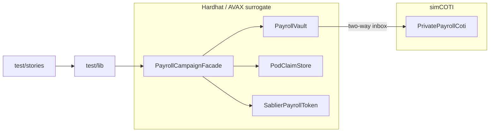

# Architecture — PoD Payroll Port

## Split

## Claim flow (iteration 2 — full async)

1. `freshCampaign` builds PoD merkle tree, deploys facade, registers leaves on COTI + facade
2. `claimPackage` / `preparePayload` sets `PodClaimStore` with `itUint256` + `proofHandle`
3. Facade `_preProcessClaim` (time, fee, merkle, amount)
4. Facade `requestPayout` → inbox two-way to COTI; `ClaimInstant` emitted in same tx (story event scope)
5. `runCrossChainTwoWayRoundTrip` mines COTI `verifyAndCredit(gtUint256, proofHandle)`
6. Vault `onPayoutAuthorized` → `facade.payoutTo` + `markClaimed`

## Merkle spec

See `docs/MERKLE_POD.md` and `test/lib/merkle.ts`.
